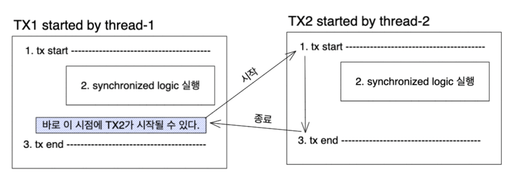
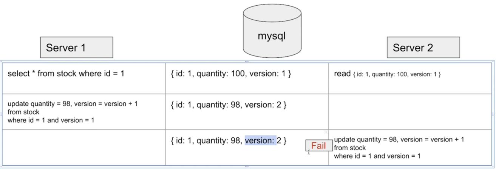
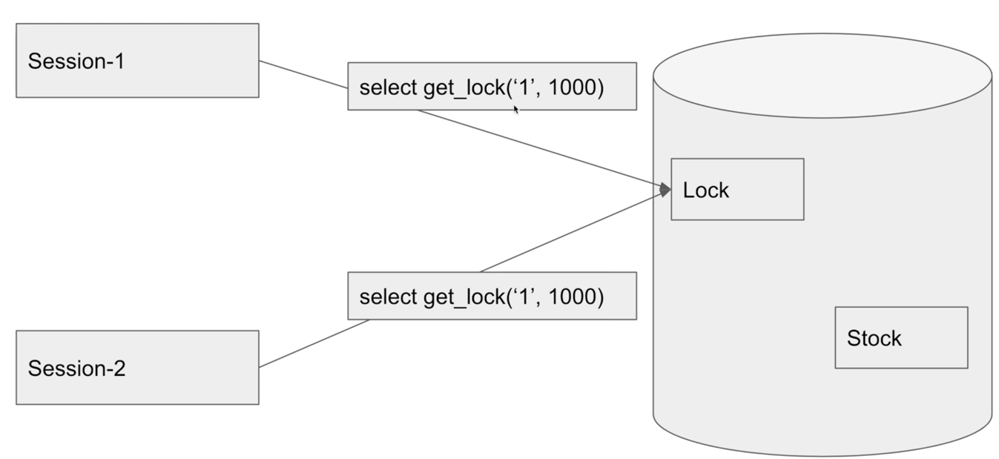
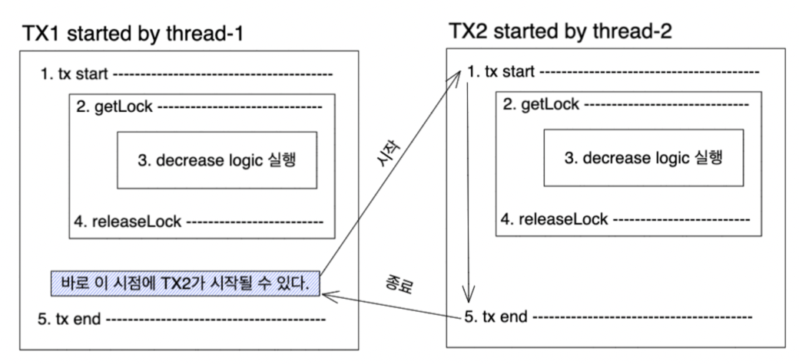
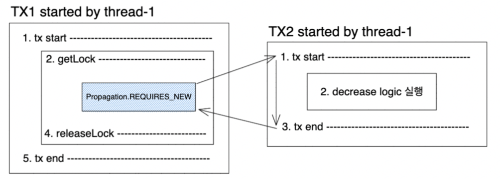

# 재고 시스템으로 알아보는 동시성 이슈 해결 방법

인프런의 [재고 시스템으로 알아보는 동시성 이슈 해결 방법](https://www.inflearn.com/course/%EB%8F%99%EC%8B%9C%EC%84%B1%EC%9D%B4%EC%8A%88-%EC%9E%AC%EA%B3%A0%EC%8B%9C%EC%8A%A4%ED%85%9C/dashboard) 강의를 참고하였습니다.  
재고 시스템에서 발생하는 동시성 이슈를 다음 세 가지 방법으로 해결하는 과정을 정리하였습니다. 

1. ``synchronized`` 사용
2. ``Database Lock`` 사용
3. ``Redis`` 사용

<br>

## 목차

- [1. 실습 환경](#1-실습-환경)
- [2. 간단한 재고 시스템 로직](#2-간단한-재고-시스템-로직)
- [3. 해결 방법 1 : synchronized 사용](#3-해결-방법-1--synchronized-사용)
- [4. 해결 방법 2 : Database Lock 사용](#4-해결-방법-2--database-lock-사용)
- [5. 해결 방법 3 : Redis 사용](#5-해결-방법-3--redis-사용)

<br>

## 1. 실습 환경
- Springboot 
- JPA
- MySQL
- Redis

<br>

## 2. 간단한 재고 시스템 로직

> **Stock 감소 로직**
```java
@Transactional
public void decrease(Long id, Long quantity) {
        Stock stock = stockRepository.findById(id).orElseThrow();
        stock.decrease(quantity);
}
```
- stock을 가져와서 quantity만큼 감소시키는 간단한 로직입니다.
- 하지만 여러 thread가 동시에 위의 코드를 실행시키게 되면 ``Race condition``이 발생하게 됩니다.
  - 이를 해결하기 위해 thread 하나씩만 접근 가능하도록 처리가 필요합니다.

<br>

## 3. 해결 방법 1 : synchronized 사용

> **synchronized keyword 추가**
```java
@Transactional
public synchronized void decrease(Long id, Long quantity) {
        Stock stock = stockRepository.findById(id).orElseThrow();
        stock.decrease(quantity);
}
```
- 자바에서 자원하는 ``synchronized``를 활용하면 해당 메서드에 thread 하나씩만 접근하도록 처리가 가능합니다.
- 하지만 위와 같이 적용하여도 ``@Transactional``로 인해 동일한 문제가 발생합니다.

<br>

>**문제점**

````java
// TransactionStockService 예시
private StockService stockService;

public void decrease(Long id, Long quantity) {
       startTransaction(); // 트랜잭션 시작

       stockService.decrease(id, quantity); 

       // 1) here

       endTransaction(); // 트랜잭션 끝 
}
````
- 문제는 Spring에서 ``@Transactional``이 적용된 객체를 대상으로 프록시를 적용하기 때문에 발생합니다. 
- 위와 같이 StockService의 비즈니스 로직(decrease)을 트랜잭션 관련 로직으로 감싸게 됩니다. (start, endTransaction은 편의상 대략적인 이름을 작성하였습니다.)
- decrease 로직에 ``synchronized``가 적용되어 있다고 해도 프록시의 endTransaction이 호출되기 전까지는 Database에 반영이 되지 않는 상태가 됩니다.
  - 따라서 위의 주석 부분(``1) here``)의 시점에 다른 thread가 decrease 로직을 실행할 수 있게 됩니다.
- 따라서 동일하게 동시성 이슈가 발생합니다.

그림으로 다시 정리하면 다음과 같습니다.



<br>

> **간단한 문제 해결 및 한계**

````java
public synchronized void decrease(Long id, Long quantity) {
        Stock stock = stockRepository.findById(id).orElseThrow();
        stock.decrease(quantity);
        stockRepository.saveAndFlush(stock);
}
````
- 간단하게는, 이러한 기능을 하는 ``@Transactional``을 제거하고 ``saveAndFlush``를 직접 호출하는 방법이 있습니다.
- 하지만 ``synchronized``는 서버 프로세스가 1개일 경우에만 적용 가능한 방법입니다. 프로세스가 여러 대일 경우 결국 Thread가 여러 개인 상황과 동일하게 Database에 동시 접근할 수 있게 되어 Race condition이 발생하기 때문입니다.
- 실무에서는 서버 프로세스가 여러 대이기 때문에 ``synchronized``는 거의 사용되지 않습니다.

<br>

## 4. 해결 방법 2 : database lock 사용

> **1. Pessimistic(비관적) Lock 활용하여 해결**

- 실제로 데이터에 Lock을 걸어서 정합성을 맞추는 방법입니다.
- Lock의 종류는 크게 다음과 같습니다.
  - ``Exclusive Lock(배타적 잠금)`` : 다른 트랜잭션에서 READ, UPDATE, DELETE를 할 수 없도록 합니다. ``LockModeType.PESSIMISTIC_WRITE``에 해당됩니다.
  - ``Shared Lock(공유 잠금)`` : 다른 트랜잭션에서 UPDATE, READ를 할 수 없도록 합니다. ``LockModeType.PESSIMISTIC_READ``에 해당됩니다.
- 데드락이 걸릴 수 있으므로 주의해서 사용해야 합니다.

<br>

> **코드**

실습에서는 PESSIMISTIC_WRITE(배타 잠금)을 통해 Lock을 걸어보도록 하겠습니다.
````java
public interface StockRepository extends JpaRepository<Stock, Long> {

    @Lock(value = LockModeType.PESSIMISTIC_WRITE)
    @Query("select s from Stock s where s.id = :id")
    Stock findByIdWithPessimisticLock(Long id);
}
````
테스트는 통과하지만 ``SELECT ~ FOR UPDATE``쿼리가 발생하게 됩니다. 즉 읽을 때도 Lock을 거는 아주 비관적인 Lock이라고 볼 수 있겠습니다.

<br>

> **2. Optimistic(낙관적) Lock 활용하여 해결**

- 실제로 Lock을 이용하지 않고 Version을 이용함으로써 정합성을 맞추는 방법입니다.
- 먼저 데이터를 읽은 후에 Update(변경) 수행 시 현재 읽은 버전과 동일한지 확인 후 업데이트를 진행하게 됩니다.
- 버전이 다를 경우에는 다시 읽은 후 작업을 수행해야 합니다. 즉 재시도로직을 추가로 구현해주어야 합니다.
- 락을 잡기 않기 때문에 Pessimistic Lock에 비해 성능 상 이점이 있습니다.

아래와 같이 두 개의 Server가 동시에 DB에 접근하는 상황을 가정해봅시다.



1. Server 1이 ``id=1``인 데이터에 접근하여 READ를 수행했습니다. 이 때 ``Version=1``입니다.
2. Server 2도 ``id=1``인 동일 데이터에 접근해서 READ를 수행했습니다. 마찬가지로 ``Version=1``입니다.
3. Server 1에서 ``id=1``인 데이터의 수량을 UPDATE 하였습니다. 동시에 ``Version=2``로 UPDATE를 수행하였습니다.
4. Server 2에서 UPDATE를 시도하였으나 DB의 ``Version=2``이기 때문에 수정에 실패하게 됩니다.

이처럼 SELECT 시점에 트랜잭션 내부에 버전 속성의 값을 보유하고 트랜젝션이 업데이트를 하기 전에 버전 속성을 다시 확인합니다.
그 동안에 버전 정보가 변경이 되면 ``OptimisticLockException``이 발생하고 변경되지 않으면 트랜잭션은 버전속성을 증가하는 업데이트 하게 됩니다.

<br>

> **코드**

LockModeType을 OPTIMISTIC으로 반영해줍니다.
````java
public interface StockRepository extends JpaRepository<Stock, Long> {
  @Lock(value = LockModeType.OPTIMISTIC)
  @Query("select s from Stock s where s.id = :id")
  Stock findByIdWithPessimisticLock(Long id);
}
````

Entity에서는 Version을 관리할 수 있는 속성을 추가해줍니다.

````java
@Entity
public class Stock {

    @Id
    @GeneratedValue(strategy = GenerationType.IDENTITY)
    private Long id;

    @Version
    private Long version;
    
    // ...
````

재시도를 위해 Facade 패턴을 활용하여 Service를 감싸줍니다.

````java
@Service
public class OptimisticLockStockFacade {

    private OptimisticLockStockService optimisticLockStockService;

    public OptimisticLockStockFacade(OptimisticLockStockService optimisticLockStockService) {
        this.optimisticLockStockService = optimisticLockStockService;
    }

    public void decrease(Long id, Long quantity) throws InterruptedException {
        while (true) {
            try {
                optimisticLockStockService.decrease(id, quantity);
                break;
            } catch (Exception e) {
                Thread.sleep(50);
            }
        }
    }
}
````
- 실패 시(변경 시도 시 Version이 다를 경우) Sleep을 통해 일정 시간 후에 재시도를 진행할 수 있도록 합니다.
 
<br>

> **3. Named Lock 활용하여 해결**



- 말 그대로 이름을 가진 metadata Lock입니다. 해당 이름을 가진 Lock을 획득한 후 해제할 때까지 다른 세션은 이 Lock을 획득할 수 없습니다.
- ``GET_LOCK``을 이용해 Lock을 획득하고, ``RELEASE_LOCK``을 통해 Lock을 Release 합니다.
- Pessimistic Lock과 유사하나 차이는 다음과 같습니다.
  - Pessimistic Lock : 대상 테이블이나 레코드에 Lock을 겁니다. timeout 적용이 어렵습니다.
  - Named Lock : 단순히 사용자가 지정한 문자열에 대해 Lock을 겁니다. Native Query를 통해 쉽게 timeout을 적용할 수 있습니다.
- 별도의 (Redis와 같은) 솔루션이 없을 경우에도 분산락을 구현할 수 있습니다.
- 트랜잭션 종료 시 락 해제, 세션 관리(커넥션)를 추가로 해줘야 합니다. 
- 커넥션 풀을 추가로 차지하기 때문에 다른 서비스에 영향을 줄 수 있으므로 실제로 사용할 경우 다른 DataSource로 분리해서 사용되는걸 권장합니다.
  - Lock을 얻기 위한 추가 쿼리가 발생하기 때문입니다.

<br>

> **코드**

Lock 획득을 위한 Native Query를 가진 Repository를 추가합니다.(위에서 언급된대로 실무에서는 다른 DataSource를 사용하는 것을 권장합니다.)
````java
public interface LockRepository extends JpaRepository<Stock, Long> {
    @Query(value = "SELECT get_lock(:key, 3000)", nativeQuery = true)
    void getLock(String key);

    @Query(value = "SELECT release_lock(:key)", nativeQuery = true)
    void releaseLock(String key);
}
````

<br>

마찬가지로 Service를 감싸는 Facade를 생성하고, 아래와 같이 Lock으로 비즈니스 로직을 감쌉니다.
````java
@Transactional
public void decrease(Long id, Long quantity) {
        try {
            lockRepository.getLock(id.toString());
            stockService.decrease(id, quantity);
        } finally {
            lockRepository.releaseLock(id.toString());
        }
}
````

이 때 유의해야할 점으로는 아래와 같이 Service의 decrease 메서드 트랜잭션을 REQUIRES_NEW를 통해 사용해서 분리해야 한다는 것입니다.
```java
@Transactional(propagation = Propagation.REQUIRES_NEW)
public synchronized void decrease(Long id, Long quantity) {
        Stock stock = stockRepository.findById(id).orElseThrow();
        stock.decrease(quantity);
        stockRepository.saveAndFlush(stock);
}
```

<br>

이유는 앞서 살펴본 ``Synchronized`` 이슈와 동일합니다. Transaction이 완전히 종료되지 않았을 때 다른 thread에서 변경 로직에 접근할 수 있습니다.
그림으로 정리하면 다음과 같습니다.



1. 일반 ``@Transactional``만 사용하게 되면 외부 트랜잭션이 내부 트랜잭션으로 전파되어 동일한 트랜잭션 환경에 놓이게 됩니다.
2. 이로 인해 ``3. decrease logic 실행`` 부분이 종료되고, ``4. releaseLock``으로 다른 쓰레드에서 Lock을 획득 가능한 시기가 왔음에도 아직 트랜잭션이 종료되지 않아 문제가 발생합니다. 
3. 이 시점에 thread-2에 의해 두번째 트랜잭션(오른쪽)이 시작된다면 Race Condition이 발생하게 됩니다.

<br> 

따라서 아래와 같이 ``REQUIRES_NEW``를 통해 트랜잭션을 완벽히 분리시키면 해결할 수 있습니다. 핵심은 lock을 release하기 전에 Database에 commit(트랜잭션이 완전히 종료)되도록 하는 것입니다.




<br>

## 5. 해결 방법 3 : redis 사용

``Lettuce``와 ``Redission``을 활용해서 분산락을 구현할 수 있습니다.
둘을 간단히 비교하면 다음과 같습니다.

1. Lettuce 
   - ``Spring-data-redis``의존성을 통해 기본적으로 사용할 수 있습니다.
   - ``setnx(set if not exist)`` 명령을 통해 분산락을 구현합니다. 이 때 ``spin lock``을 통해 구현할 수 있습니다.
     - spin lock : 락을 사용하려는 스레드가 계속 락을 체크하며 사용 가능 여부를 체크하는 방식입니다. 다시 락을 얻는 것을 시도하기 위한 retry logic이 필요합니다. 즉 while 문을 통해 계속 체크하는 로직이 필요합니다.
   - 락 획득 재시도가 필요없는 로직에 적합합니다.


2. Reddison
   - 별도의 의존성(``org.redisson:redisson-spring-boot-starter``)을 추가해야 사용할 수 있습니다.
   - pub-sub 으로 분산락을 구현합니다. 이로 인해 Lettuce와 비교하여 Redis에 부하를 덜 줍니다.
   - 락 획득 재시도를 기본으로 하는 로직에 적합힙니다.

<br>

> **1. Lettuce 활용**

활용에 앞서 redis-cli를 통해 setnx를 맛보겠습니다.

````shell
setnx 1 lock # (key로 1, value로 lock을 저장)
(integer) 1  # 성공

# 다시 동일 명령 실행
setnx 1 lock 
(integer) 0 # 이미 1이라는 key가 있으므로 실패

# 키를 지운 후
del 1

# 다시 실행
setnx 1 lock
(integer) 1 # 키가 지워졌기 때문에 다시 저장 성공
````
- setnx는 ``set if not exist``라는 의미로, 없는 Key인 경우 성공적으로 set을 수행하고 1을 반환하는 명령입니다.
- 앞서 특정 문자열을 지정하고 Lock을 거는 MySQL의 namedLock과 동일하다고 볼 수 있습니다. 하지만 세션 관리(커넥션)에 신경을 안써도 된다는 점이 큰 장점입니다.

<br>

> **코드**

우선 Lock을 관리하는 RedisLockRepository를 생성합니다.

````java
@Component
public class RedisLockRepository {

    private RedisTemplate<String, String> redisTemplate;

    public RedisLockRepository(RedisTemplate<String, String> redisTemplate) {
        this.redisTemplate = redisTemplate;
    }

    public Boolean lock(Long key) {
        return redisTemplate
            .opsForValue()
            .setIfAbsent(generateKey(key), "lock", Duration.ofMillis(3_000));
    }

    public Boolean unlock(Long key) {
        return redisTemplate.delete(generateKey(key));
    }

    private String generateKey(Long key) {
        return key.toString();
    }
}
````
- ``redisTemplate.setIfAbsent()``를 통해 ``setnx`` 명령을 사용할 수 있습니다. key와 value를 지정하고 Duration을 통해 Duration을 지정합니다.
- 이를 감싸는 lock 로직은 key에 해당되는 값이 존재할 경우 false를 반환하게 됩니다.
- unlock을 통해 key를 삭제하는 로직을 추가하여 lock을 release 할 수 있도록 합니다.

<br>

활용 로직은 다음과 같습니다.

````java
public void decrease(Long key, Long quantity) throws InterruptedException {
        while (!redisLockRepository.lock(key)) {
            Thread.sleep(100);
        }
        try {
            stockService.decrease(key, quantity);
        } finally {
            redisLockRepository.unlock(key);
        }
}
````
- 앞서 구현한 lock 메서드를 호출하여 Lock 획득을 계속 시도합니다.
- 여기에서 사용된 while이 spin lock이라고 볼 수 있습니다. 이러한 방식이 Redis에 부하를 줄 수 있기 때문에 Thread.sleep을 통해 락 획득 시도 간 텀을 두어 부하를 줄였습니다.
- 감소 후 unlock을 통해 락을 삭제해줍니다. 만약 해당 로직이 실행되지 않았더라도 앞서 락에 TTL을 설정하였기 때문에 데드락을 방지할 수 있습니다.

<br>

> **2. Redisson 활용**

활용을 위해 먼저 Redisson 의존성을 추가합니다. 
````
implementation 'org.redisson:redisson-spring-boot-starter:3.17.4'
````

<br>

이후 RedissonClient를 주입받아 활용할 수 있습니다.

````java
@Component
public class RedissonLockStockFacade {

    private RedissonClient redissonClient;
    private StockService stockService;

    public RedissonLockStockFacade(RedissonClient redissonClient, StockService stockService) {
        this.redissonClient = redissonClient;
        this.stockService = stockService;
    }

    public void decrease(Long key, Long quantity) {
        RLock lock = redissonClient.getLock(key.toString());
        try {
            boolean available = lock.tryLock(10, 1, TimeUnit.SECONDS);
            if (!available) {
                System.out.println("lock 획득 실패");
                return;
            }
            stockService.decrease(key, quantity);
        } catch (InterruptedException e) {
            throw new RuntimeException(e);
        } finally {
            lock.unlock();
        }
    }
}
````
- ``lock.tryLock(락 획득을 위해 대기하는 총 시간, 임대 시간, 시간 단위)``를 통해 락 획득을 시도합니다.
- 임대 시간이 지나거나 ``lock.unlock()``을 호출하면 이를 구독하는(tryLock을 호출한) 다른 스레드들에게 알림이 가게되고 획득 가능한 상태가 됩니다. 
- ``Lettuce``처럼 while을 통한 spin lock 부하를 주지 않기 때문에 부담을 덜 주게 됩니다.


